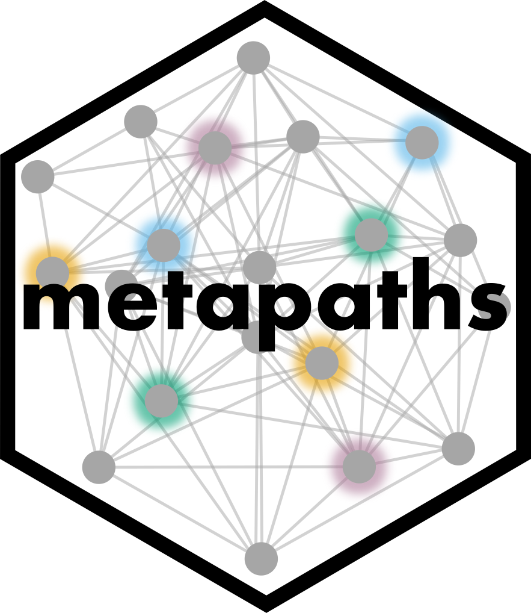
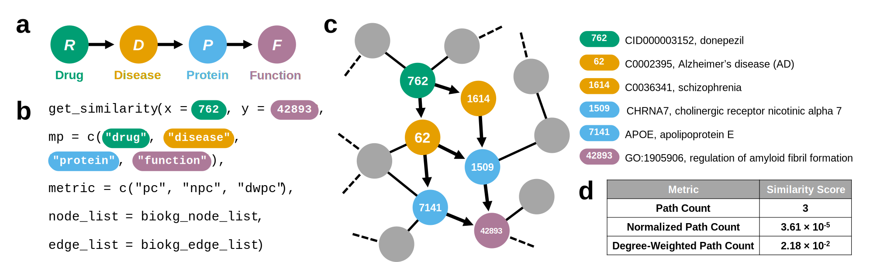

# `metapaths`: Meta-Path-Based Network Similarity Search in KGs <a href="https://github.com/ayushnoori/metapaths"></a>

[](https://www.ayushnoori.com/metapaths)
[](https://zitniklab.hms.harvard.edu/projects/metapaths/)
[](https://opensource.org/licenses/MIT)
[](https://zenodo.org/badge/latestdoi/382086164)

Large-scale heterogeneous biomedical knowledge graphs (KGs) use graph structures to represent and study multi-typed relational information in biological systems. Network relationships in a KG can be quantified by similarity search methods; however, such methods must consider the diversity of node types contained within that KG. To distinguish between node types, we leverage meta paths, a general graph-theoretic approach for flexible similarity search in large networks. Meta paths are defined as sequences of node types which define a walk from the origin node to the destination node, and are widely used in biomedical network analysis.

To support meta paths in R, we present `metapaths`, the first R software package to perform meta path-based similarity search in heterogeneous KGs. The `metapaths` package offers various in-built similarity metrics for node pair comparison by querying KGs represented as either edge or adjacency lists, as well as auxiliary aggregation methods to measure set-level relationships. This framework facilitates the scalable and flexible modeling of network similarities in KGs with applications across biomedical KG learning.

## Installation

`metapaths` is designed for the [R](https://www.r-project.org/) programming language and statistical computing environment. To install the latest version of this package, please run the following line in your R console:

```{r}
devtools::install_github("ayushnoori/metapaths")
```

## Custom Similarity Metrics

In addition to the in-built similarity metrics, users may also define their own custom metrics. To define a custom similarity metric, please complete the following steps:

1. Add a new function to [`similarity-metrics.R`](https://github.com/ayushnoori/metapaths/blob/master/R/similarity-metrics.R) with the `get_<similarity-metric>()` nomenclature.

2. Edit the `get_similarity_function()` function to add your metric to the list of allowed similarity metrics.

3. Submit a pull request for approval.

## Custom Aggregation Methods

Akin to custom similarity metrics, users may also define custom aggregation methods for set-level comparison. To define a custom aggregation method, please complete the following steps:

1. Add a new function to [`aggregation-methods.R`](https://github.com/ayushnoori/metapaths/blob/master/R/aggregation-methods.R) with the `get_<aggregation-method>()` nomenclature.

2. Edit the `get_aggregation_function()` function to add your metric to the list of allowed aggregation methods.

3. Submit a pull request for approval.

## Evaluation on a Biomedical KG

Evaluation of the `metapaths` package on `ogbl-biokg`, an open-source biomedical KG available from the [Open Graph Benchmark](https://ogb.stanford.edu), recovered meaningful drug and disease-associated relationships as quantified by high similarity scores. For example, the meta path traversal function identified three paths following the specified meta path that connect donepezil – a drug used to treat Alzheimer’s disease (AD) – with the regulation of amyloid fibril formation pathway, which is implicated in AD.



Additional usage examples are available in the [`ogbl-biokg` vignette](https://www.ayushnoori.com/metapaths/articles/biokg-demo.html).

## Documentation

* The `metapaths` R package is freely available under MPL 2.0 [via GitHub](https://github.com/ayushnoori/metapaths).
* Package documentation and usage examples are available [here](https://www.ayushnoori.com/metapaths).
* For more information, please visit the `metapaths` [project website](https://zitniklab.hms.harvard.edu/projects/metapaths/).

## Citation

If you find `metapaths` useful, please cite our forthcoming paper:

```
@article{noori2022metapaths,
  title={metapaths: similarity search in heterogeneous knowledge graphs via meta paths},
  author={Noori, Ayush and Tan, Amelia L.M. and Li, Michelle M. and Zitnik, Marinka},
  journal={arXiv: 2209.0000},
  volume={},
  number={},
  pages={},
  year={2022},
  publisher={}
}
```

## Contact

Should any questions arise, please [open a GitHub issue](https://github.com/ayushnoori/metapaths/issues/new) or contact [anoori@college.harvard.edu](anoori@college.harvard.edu).

<!-- ## Build Documentation

The documentation for `metapaths` is built using the `roxygen2` package. To build the documentation, run:

```{r}
roxygen2::roxygenise()
```

## Build Website

The website for `metapaths` is built using the `pkgdown` package. To compile and render the website, run:

```{r}
pkgdown::build_site()
``` -->
